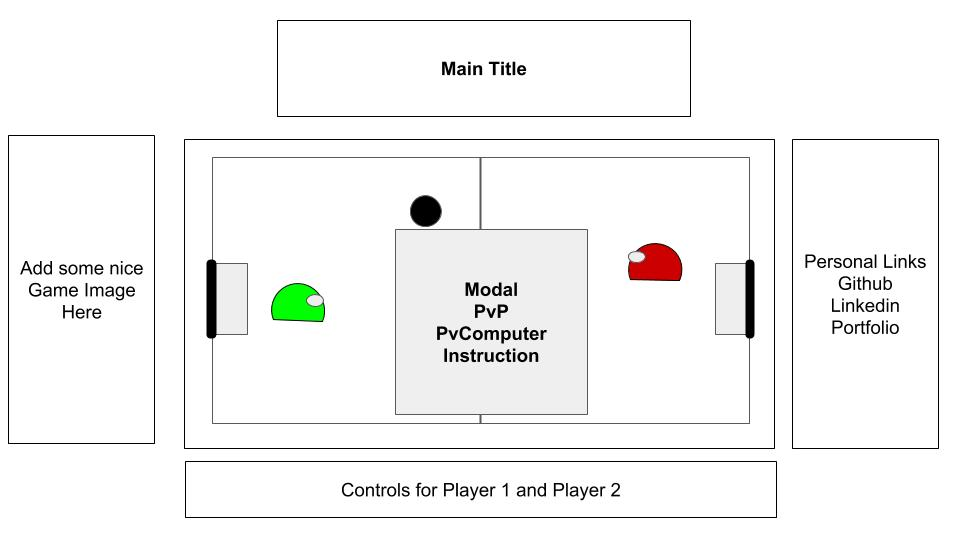

## JavaScript Project Proposal: Slime Air Hockey

### Background

Slime originated from the old browser game Slime Volleyball where each player controls a semicircle character (slime) and plays volleyball each other. For this project, the sport will be the arcade classic air hockey. There will be a goal on either side and points are scored when the player enters the opposite goal. The ball or puck can bounce off all four sides of the wall except for the goal. The game starts off with the puck in the middle and players jockey for the puck. After a goal, the loser gets the initiative to hit the puck first. For this game, players can cross the center line. Game will end after a set amount of time(1 - 2 mins) and winner is decided by who scored the most.

### Functionality and MVP
In this Slime Air Hockey, features to build are:
*  start and restart game through a modal
*  modal will contain instruction for controls and rules
*  human vs human games
*  human vs simple ai games
*  (bonus) human vs machine-learned games or (MLG)
*  a production README

### Wireframe
This app will contain a single screen with game window in the center. Control instructions will be on the bottom of the game window as well as on loading page in a modal. Personal Links such as Linkedin, Github, and Portfolio will be on the right of the game window.

### Architecture and Technologies
*  JavaScript
*  Planck.js and/or popmotion.js for ball physics
*  ml.js for machine learning

The scripts involved for this projects are:

`board.js` - handles the drawing of the board  
`game.js` - handles the game logic when points are scored and when the game is won  
`player.js` - handles the players input controls  
`puck.js` - handles the physics of the puck  
`computer.js` - handles the computer movements through some form of machine learning

### Implementation Timeline

__Day 1:__ Setup all Node modules and get webpack running. Build out canvas for the board. Build out UI features for game, such as points and timer.  
__Day 2:__ Build out player controls and draw canvas of player slime. Build out puck and add ball physics to the puck. Write out winning conditions when ball is at certain location  
__Day 3:__ Handle logic between games and the use of the modal. Make sure game restarts and is running on a basic player v player level   
__Day 4:__ Create an ai using simple ball tracking algorithms and then tackle on some machine learning for more advance ai

### Bonus Features
*  Allow players to choose color of their slimes
*  Add even more advance machine learning algorithms 
